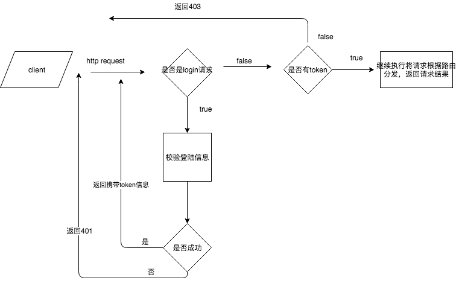

# Beego 之 JWT 认证

## 工作原理

## JWT
[认识JWT](https://www.cnblogs.com/cjsblog/p/9277677.html)

[jwt-beegoo](https://github.com/juusechec/jwt-beego)

# Beego Filter

beego 支持自定义过滤中间件，例如安全验证，强制跳转等。可以在执行的5个位置进行处理，分别是
- 1. BeforeStatic 静态地址之前
- 2. BeforeRouter 寻找路由之前
- 3. BeforeExec 找到路由之后，开始执行相应的 Controller 之前
- 4. AfterExec 执行完 Controller 逻辑之后执行的过滤器
- 5. AfterExec 执行完 Controller 逻辑之后执行的过滤器

[参考文档](https://beego.me/docs/mvc/controller/filter.md)
